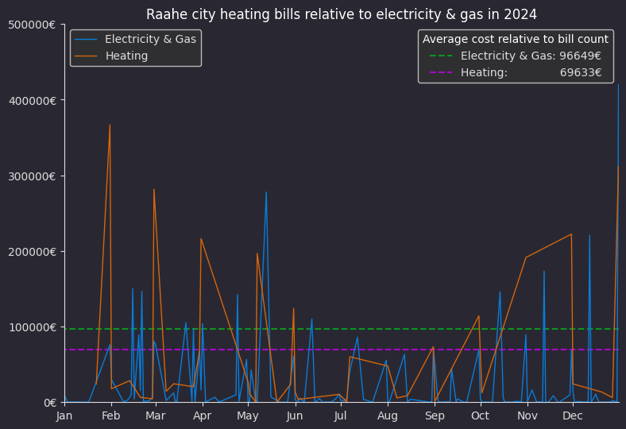
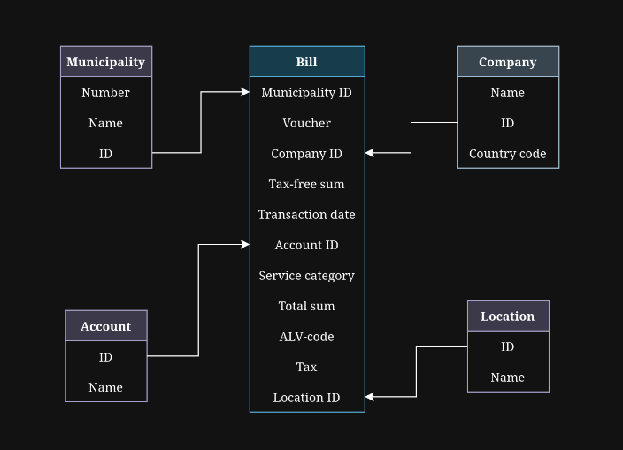

# Bill cost comparison from relational database - SQL dashboard
Comparison of electricity &amp; gas bills to heating bill costs from open bill data of Raahe city 2024

This graph reads data from an local mariadb database and automatically displays needed data. 
The displayed values (including the year in the title) are fully automatic, utilizing the data queried from the database.

The data was sourced from [avoindata.fi](https://www.avoindata.fi/) in the form of excel sheet with nearly fifty thousand rows of bill data.
Using python the data was split into several CSV files so they could then be inputted into a relational database, thus removing the need to repeat duplicate data on every row.

(Fields of these tables are entirely derived from the original excel sheet)  

Both bill and account tables are queried for the data shown in this graph.
Due to the differences in bill counts, the script automatically adjusts bill cost averages relative to the count and the data is displayed as relative averages.

#### Data sources:
- [Raahen kaupungin ostolaskut 2024](https://www.avoindata.fi/data/fi/dataset/raahen-kaupungin-ostolaskut-2024)
